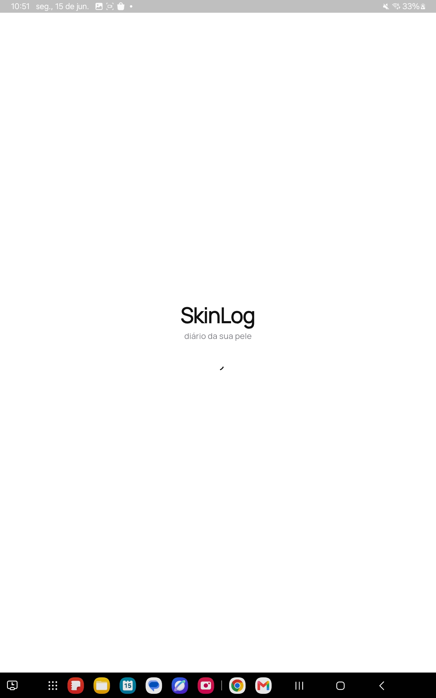
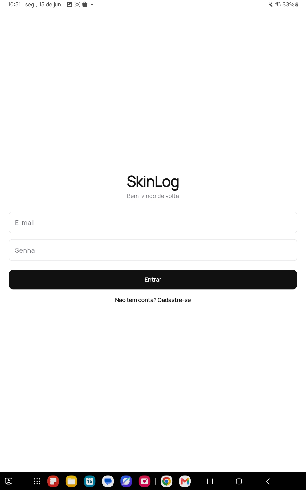
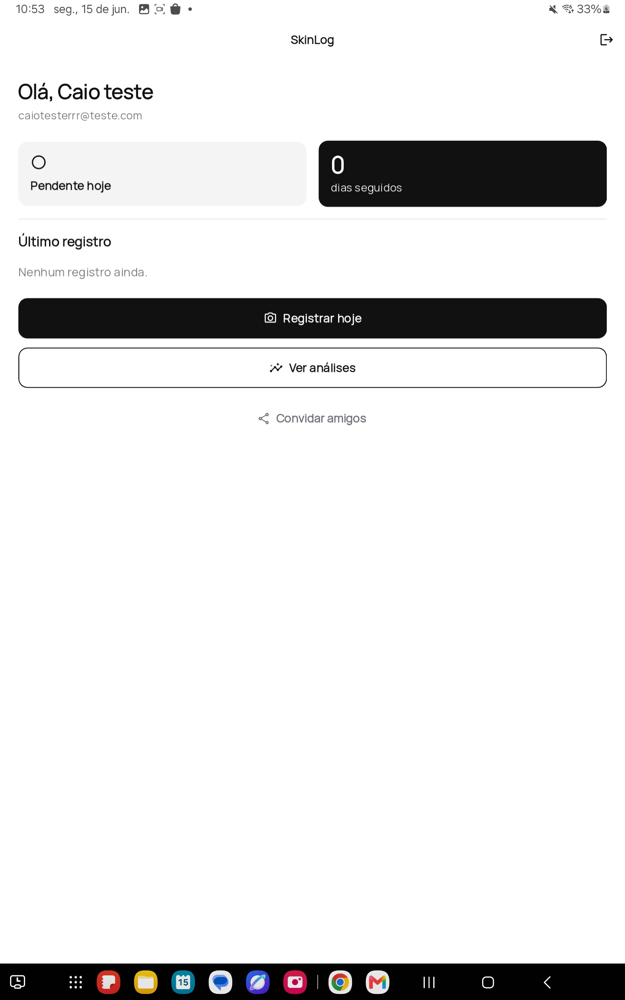
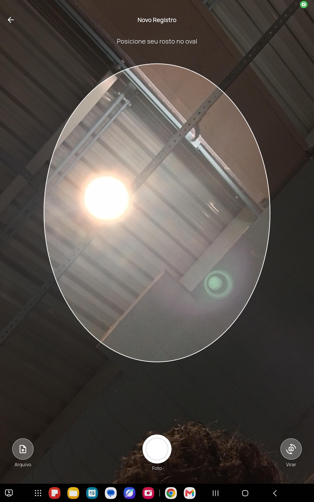
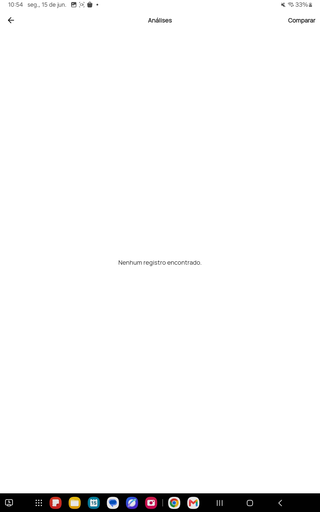

# 🧴 SkinLog - Atividade Ponderada Semana 09 - Caio de Alcantara Santos

## 📑 Sumário

- [1. Visão Geral](#1-visão-geral)
- [2. Demonstração](#2-demonstração)
- [3. Funcionalidades](#3-funcionalidades)
- [4. Atendimento aos Requisitos](#4-atendimento-aos-requisitos)
- [5. Arquitetura](#5-arquitetura)
- [6. Como Executar](#6-como-executar)
- [7. Considerações Finais](#7-considerações-finais)
- [8. Autor](#8-autor)


## 1. Visão Geral

### 1.1 Problema

Pessoas em tratamentos dermatológicos (como Roacutan/Isotretinoína) têm dificuldade em acompanhar visualmente a evolução da pele ao longo do tempo. Fotos ficam perdidas na galeria, não há registro estruturado e é difícil comparar o progresso de forma objetiva. Este é um problema que eu, o autor, sofro diariamente.

### 1.2 Solução Proposta

**SkinLog** é um aplicativo mobile que permite ao usuário registrar fotos diárias do rosto, receber análises automatizadas por IA sobre a condição da pele e comparar a evolução ao longo do tratamento. O app funciona como um diário visual inteligente da pele.

### 1.3 Público-Alvo

- Pessoas em tratamento dermatológico (Roacutan, ácidos, etc.)
- Pessoas que desejam acompanhar a saúde da pele
- Pacientes que querem compartilhar evolução com dermatologistas

### 1.4 Diferenciais

- Análise automatizada por IA (Gemini Vision) a cada foto
- Comparador antes/depois com seleção de duas fotos
- Score numérico de evolução da pele
- Dados sensíveis protegidos com bucket privado e RLS


## 2. Demonstração

### 2.1 Vídeo

https://www.youtube.com/shorts/RmO5_gJjMdg

### 2.2 Telas do Aplicativo

#### Splash / Inicialização



#### Login / Cadastro



#### Home



#### Câmera (captura com guia oval)



#### Análises (listagem)




## 3. Funcionalidades

As principais funcionalidades do app incluem:

1. Cadastro e login de usuário.
2. Registro fotográfico do rosto pela câmera frontal do próprio aplicativo.
3. Análise automática da pele por inteligência artificial a cada foto enviada.
4. Galeria com o histórico de registros, cada um com seu score e detalhes.
5. Comparação entre duas fotos de períodos diferentes, com a diferença de score.
6. Lembrete diário por notificação local quando o registro do dia ainda não foi feito.
7. Compartilhamento do app pelo menu nativo do sistema.


## 4. Atendimento aos Requisitos

A tabela abaixo resume como cada requisito da atividade foi atendido.

| Requisito | Como foi atendido | Onde |
|---|---|---|
| Aplicação mobile | App em Flutter | `app_mobile/skin_log_app` |
| Mais de 2 telas | Splash, Login, Home, Câmera e Análises | `lib/screens` |
| Navegação funcional | Rotas nomeadas com `Navigator` | `lib/main.dart` |
| Backend funcional | API em FastAPI | `backend/app` |
| Banco de dados | PostgreSQL no Supabase | tabelas `profiles` e `records` |
| API externa | Google Gemini para análise da pele | `backend/app/services/ai_service.py` |
| Notificações | Lembrete diário local | `lib/services/notification_service.dart` |
| Compartilhamento | Menu nativo do sistema | `lib/screens/home_screen.dart` |
| Hardware do dispositivo | Câmera frontal com guia oval | `lib/screens/camera_screen.dart` |
| Tratamento de erros | Estados de carregamento e mensagens de erro | telas e `lib/services/api_service.dart` |

### 4.1 Implementação Mobile

O aplicativo foi feito em Flutter e roda em Android e na web (Chrome). A comunicação com o servidor é feita por requisições HTTP, e os tokens de sessão ficam salvos no dispositivo com `shared_preferences`.

### 4.2 Múltiplas Telas e Navegação

São cinco telas: Splash, Login, Home, Câmera e Análises. A Splash decide se o usuário vai para o login ou para a home conforme a sessão salva. A navegação usa rotas nomeadas definidas em `main.dart`.

### 4.3 Backend Funcional

O backend é uma API em FastAPI organizada em rotas, serviços e schemas. Ele expõe endpoints de autenticação e de registros sob o prefixo `/api/v1`, além de uma rota de health check. A análise de IA roda em segundo plano após o envio da foto, então a resposta ao usuário não fica travada esperando o Gemini.

### 4.4 Banco de Dados

Os dados ficam no PostgreSQL do Supabase, em duas tabelas: `profiles`, que estende os usuários de autenticação, e `records`, que guarda cada registro de pele. As fotos ficam em um bucket privado do Supabase Storage, e o acesso às imagens é feito por URLs assinadas com validade de uma hora.

### 4.5 API Externa

A análise da pele usa o Google Gemini. O backend envia os bytes da imagem junto com um prompt que pede um JSON com score, vermelhidão, acne, ressecamento, oleosidade, observações e recomendações. O resultado é gravado no registro correspondente.

### 4.6 Sistema de Notificações

O app usa notificações locais para lembrar o usuário de registrar a pele. Quando o registro do dia ainda não foi feito, é agendada uma notificação para as 20h. Se o registro já foi feito, o lembrete é cancelado.

### 4.7 Compartilhamento

A tela Home tem um botão que abre o menu de compartilhamento nativo do sistema com um convite para conhecer o app. O recurso usa o pacote `share_plus`.

### 4.8 Uso de Hardware do Dispositivo

A tela de Câmera usa a câmera frontal do aparelho com um guia oval para posicionar o rosto sempre da mesma forma. Também é possível escolher uma foto da galeria como alternativa.

### 4.9 Tratamento de Erros, Carregamentos e Respostas da API

As telas exibem estados de carregamento durante as requisições e mostram mensagens quando algo dá errado, como credenciais inválidas ou falha de câmera. No app, as respostas com erro da API são convertidas em uma exceção própria (`ApiException`) com a mensagem retornada pelo servidor.


## 5. Arquitetura

O projeto tem duas partes: o aplicativo Flutter e a API em FastAPI. O app fala apenas com a API, e a API concentra o acesso ao Supabase e ao Gemini.

### Endpoints principais

| Método | Rota | Descrição |
|---|---|---|
| GET | `/health` | Verifica se a API está no ar |
| POST | `/api/v1/auth/signup` | Cria conta e perfil |
| POST | `/api/v1/auth/login` | Faz login |
| POST | `/api/v1/auth/refresh` | Renova a sessão |
| POST | `/api/v1/auth/logout` | Encerra a sessão |
| GET | `/api/v1/auth/me` | Retorna o usuário atual |
| GET | `/api/v1/records` | Lista os registros |
| POST | `/api/v1/records` | Cria um registro com foto |
| GET | `/api/v1/records/latest` | Último registro |
| GET | `/api/v1/records/streak` | Dias seguidos com registro |
| POST | `/api/v1/records/compare` | Compara dois registros |
| GET | `/api/v1/records/{id}` | Detalhe de um registro |
| DELETE | `/api/v1/records/{id}` | Remove um registro |


## 6. Como Executar

### 6.1 Pré-requisitos

- Python 3.12 para o backend.
- Flutter (SDK Dart 3) para o aplicativo.
- Uma conta no Supabase com a tabela `profiles`, a tabela `records` e o bucket `skin-photos`.
- Uma chave de API do Google Gemini.

### 6.2 Configuração de Variáveis de Ambiente

O backend lê as configurações de um arquivo `.env` dentro de `backend`. Use o `backend/.env.example` como base.

```env
SUPABASE_URL=https://xxxxx.supabase.co
SUPABASE_ANON_KEY=eyJ...
SUPABASE_SERVICE_ROLE_KEY=eyJ...
SUPABASE_JWT_SECRET=seu-jwt-secret
SUPABASE_BUCKET=skin-photos

GEMINI_API_KEY=AIza...
GEMINI_MODEL=gemini-2.5-flash

BACKEND_CORS_ORIGINS=*
ENV=dev
```

O arquivo `.env` não é commitado no repositório.

### 6.3 Backend

```bash
cd backend
python3 -m venv venv
source venv/bin/activate
pip install -r requirements.txt
uvicorn app.main:app --reload --host 0.0.0.0 --port 8000
```

A documentação interativa fica disponível em `http://localhost:8000/docs`.

### 6.4 Aplicativo Mobile

```bash
cd app_mobile/skin_log_app
flutter pub get
flutter run
```

Por padrão o app aponta para `http://localhost:8000` na web e para `http://10.0.2.2:8000` no emulador Android, então o backend precisa estar rodando antes.

### 6.5 Configurar a URL do Backend no App

Para apontar o app para um backend em outro endereço (máquina na rede local, deploy, etc.), há uma configuração escondida na tela de login:

1. **Segure pressionado (long-press) o logo "SkinLog"** na tela de login.
2. No diálogo, informe a URL do servidor — apenas o `host:porta`, sem `/api/v1` (ex.: `http://192.168.0.10:8000`). O app adiciona o prefixo `/api/v1` automaticamente.
3. Toque em **Salvar**. O endereço fica guardado no dispositivo. Use **Redefinir** para voltar ao padrão.

Para acessar um backend rodando no seu PC a partir de um celular físico, use o IP da máquina na rede (ex.: `http://192.168.0.10:8000`) e rode o backend com `--host 0.0.0.0`, garantindo que o celular esteja na mesma rede Wi-Fi.
